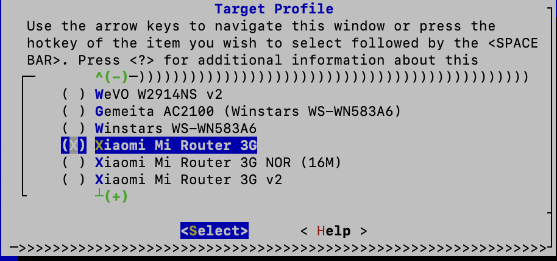
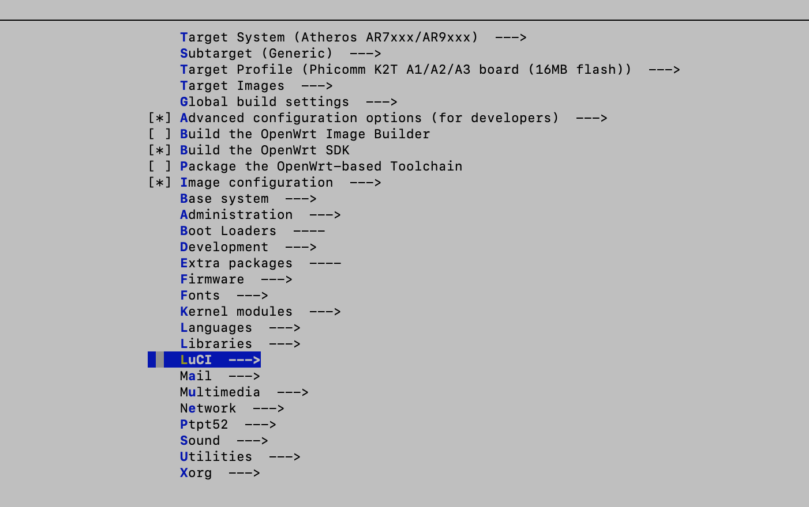

# 编译教程

很多人不知道怎样编译一个自己的固件，这里主要简单介绍大概的编译打包流程，具体的情况还需要大家自己发挥，情况千变万化，大家随机应变。

## 1 编译准备
我们建议使用[Ubuntu](https://www.ubuntu.com/)系统作为编译环境，这里以Ubuntu 18.04作为例子，其他版本也是可以的。特别注意的是，整个编译过程，都是用普通用户操作，不要用`root`用户操作。

首先要安装编译所需要的软件包:
```sh
sudo apt install build-essential ecj fastjar file flex g++ gawk gettext git git-core java-propose-classpath libelf-dev libncurses5-dev libncursesw5-dev libssl-dev python python3 subversion unzip wget zlib1g-dev
```

下载源码:
```sh
git clone https://github.com/x-wrt/x-wrt.git
cd x-wrt

#更新代码tag:
git fetch origin

#列出可以使用的版本tag:
git tag
#注意摁 q 键结束

#选择并切换到指定的版本tag:
git checkout -f <tag-name>
#比如
git checkout -f 6.0_b201911100154

#更新代码:
./scripts/feeds update -a
./scripts/feeds install -a
```

配置固件的命令`make menuconfig` 但是我们可以从配置模版开始会更轻松一些。

比如ar71xx-generic的设备可以用拷贝这个模版`feeds/x/rom/lede/config.ar71xx-generic`
内核分区限制小的设备，选用 `-nosymbol` 结尾的`config`配置模版
```sh
cp feeds/x/rom/lede/config.ar71xx-generic .config
```

还有更多配置模版，请参考目录下的`config.*`文件:
```
feeds/x/rom/lede/config.ar71xx-generic
feeds/x/rom/lede/config.ar71xx-generic-nosymbol
feeds/x/rom/lede/config.ar71xx-nand
feeds/x/rom/lede/config.ar71xx-nand-nosymbol
feeds/x/rom/lede/config.ar71xx-tiny
feeds/x/rom/lede/config.ath79-generic
feeds/x/rom/lede/config.ath79-generic-nosymbol
feeds/x/rom/lede/config.ath79-nand
feeds/x/rom/lede/config.bcm53xx-generic
feeds/x/rom/lede/config.brcm2708-bcm2709
feeds/x/rom/lede/config.brcm2708-bcm2710
feeds/x/rom/lede/config.brcm2708-bcm2711
feeds/x/rom/lede/config.ipq40xx-generic
feeds/x/rom/lede/config.ipq806x-generic
feeds/x/rom/lede/config.kirkwood-generic
feeds/x/rom/lede/config.mvebu-cortexa9
feeds/x/rom/lede/config.ramips-mt7620
feeds/x/rom/lede/config.ramips-mt7620-nosymbol
feeds/x/rom/lede/config.ramips-mt7621
feeds/x/rom/lede/config.ramips-mt76x8
feeds/x/rom/lede/config.ramips-mt76x8-nosymbol
feeds/x/rom/lede/config.ramips-rt305x
feeds/x/rom/lede/config.ramips-rt3883-nosymbol
feeds/x/rom/lede/config.sunxi-cortexa7
feeds/x/rom/lede/config.x86_64
feeds/x/rom/lede/config.x86_generic
```

## 2. 配置目标
在模版配置文件的基础上，执行`make menuconfig`命令进行个性化定制，增删应用。

首先，在菜单`Target Profile`里面选择自己的目标设备，比如`Phicomm K2T`


然后，再定位到各个子菜单，选择对应的软件包


## 3. 执行编译
命令:
```sh
make
```
或者
```sh
make -j1 V=s
```

生成的包在`bin/targets/`下面

## 3. 高阶配置
为了得到满意的固件，下面对编译配置选项做更多的详细说明，但是更多的可能并不局限于这些说明内容，还有更多期待大家自己探索。

### 3.1 选择应用
首先，进入`make menuconfig`菜单

**要编译到固件里面，就要选择`<*>`，如果只选择`<M>`只是编译成软件包`ipk`，不会打包进入固件。**

进入`LuCI - Applications`子菜单下面，选择自己想要的应用

常见的软件包:
```
luci-app-aria2 ARRIA2下载工具
luci-app-ddns DDNS工具
luci-app-mwan3 MWAN3负载均衡
luci-app-nft-qos 流量控制
luci-app-openvpn OPENVPN
luci-app-samba SAMBA网络共享
luci-app-upnp UPNP设置
luci-app-wireguard WireGuard配置界面
```

进入`Kernel modules - USB Support`菜单，选择USB支持的驱动

进入`Kernel modules - Filesystems`菜单，选择需要支持的文件系统，比如`ext4,ntfs,vfat`等

进入`Kernel modules - Wireless Drivers`菜单，选择无线支持的驱动，如果需要挂卡的驱动，也是在这里找

