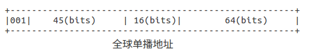
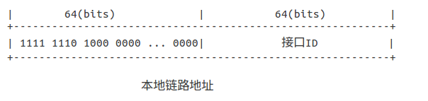
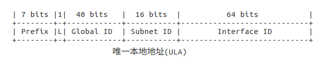

# X-wrt IPv6: 关于IPv6

## 1. IPv6 介绍

## 2. IPv6 地址
### 2.1 地址格式
+ 地址格式
IPv6地址一共128位(128 bits)
如: `2a02:9999:1234:14a:d17c:b621:978c:5ff8` 
 
+ 压缩零位: 如果地址存在连续的零, 可以用双冒号 `::` 精简表示,
例如: `2a02:9999:0000:0000:d17c:b621:978c:5ff8` 可以表示为 `2a02:9999::d17c:b621:978c:5ff8`

### 2.2 地址类型
#### 2.2.1  单播地址
+ [全球单播地址](#) 
相当于IPv4的公网IP地址, 在IPv6网络内可以全球路由, 作用域是[整个IPv6互联网](#)
格式:

  1. 固定前缀 (3bits) :  `001`
  2. 全球路由前缀 (45bits) : 这些站点会分配给ISP
  3. 子网掩码 (16bits) : ISP会分配站点内的子网络
  4. 接口ID (64bits) : 
   
参考: [RFC 4291](https://tools.ietf.org/html/rfc3587)
 

+ [链路本地地址](#)
用于单一链路内(没有路由器参与的链路)节点的通信, 类似IPv4的169.254.0.0/16(本地链路地址)
格式:

前缀: `FB80::/64`
作用: ...

+ [唯一本地地址 (ULA)](#)
ULA:  Unique Local Addresses, 这类地址是私有地址, 不能在IPv6互联网内路由的, 类似与IPv4的私网地址.用法上，ULA和IPv4的私有地址十分类似，但它具有近似的全局唯一性. 它的流量不会到达Internet去. 
格式:

  1. prefix(前缀): 固定7bits, `FC00::/7`, 所有本地地址都是7位前缀.
  2. L(标签): 设置为`1`,表示这个地址是局部分配的地址. (`0` 还没有被定义)
  3. Global ID: 由网络独自随机选择，由于40bits的随机型保证唯一行的概率很大,部署时**不需要**向一个全球机构注册使用某个前缀

   作用: 这样局域网内, ISP发生地址变时, 由于ULA可以保持不变, 网络内部的通信不会受到影响.

参考: [RFC 4193](https://tools.ietf.org/html/rfc4193)
 

+ [回环地址](#)
  IPv6会分配`::1` 或 `0:0:0:0:0:0:0:1`给回环接口`lo`, 类似IPv4的`127.0.0.1`

+ [未指定地址](#)
  `::` 或 `0:0:0:0:0:0:0:0`, 类似IPv4的`127.0.0.1`

#### 2.2.2 组播
略

