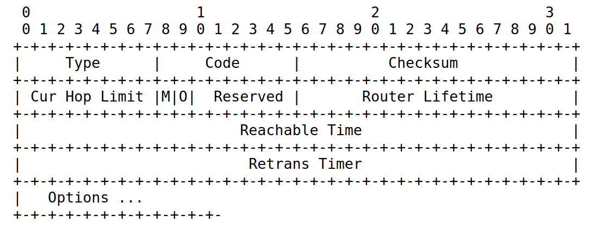

# IPv6基础: ICMPv6

## 1. 介绍
## 2. ICMPv6协议
ICMPv6 分为消息型消息和错误型消息.
### 2.1 头部 
+ 类型(type)
+ 代码(code)
+ 校验和(checksum)
+ 内容(body)

### 2.2 ICMPv6类型
|Type|功能|说明|
|---|---|---|
|1|目的不可达||
|2|数据包太大|通知源地址，不能发送数据包通知源地址，数据包太大无法转发, 限制值为接口的MTU值,(当你发送的IPv6数据包太大就会收到该类型数据包)|
|3|数据包超时|当IPV6数据包的hop limit减少到零就会收到这类型的数据包|
|4|参数问题|通知源地址，在处理 IPv6 报头或 IPv6 扩展报头时发生错误|
|128|回显请求|用来检查IPv6节点是否可达到, ping命令使用该类型数据包|
|129|回显应答|用来响应"回显请求"(Type=128), ping命令使用该类型数据包|
|130|Multicast Listener Query|
|131|Multicast Listener Report|
|132|Multicast Listener Done|
|133|[Router Solicitation](#)|主机向路由器发送路由器请求消息|
|134|[Router Advertisement](#)|路由器发送[路由通告消息](#)|
|135|Neighbor Solicitation|
|136|Neighbor Advertisement|
|137|Redirect Message|
|138|Router Renumbering|
|139|ICMP Node Information Query|
|140|ICMP Node Information Response|
|141|Inverse Neighbor Discovery|
|142|Inverse Neighbor Discovery|
|144|Home Agent Address Discovery|
|145|Home Agent Address Discovery|
|146|Mobile Prefix Solicitation|
|147|Mobile Prefix Advertisement|
|157|Duplicate Address Request Code Suffix|
|158|Duplicate Address Confirmation Code Suffix|
|160|Extended Echo Request|
|161|Extended Echo Reply|

### 2. 路由请求和路由通告
#### 2.1 路由请求
ICMPv6数据包, 类型Type为133. 
#### 2.2 路由通告
ICMPv6数据包, 类型Type为134.  
ICMPv6数据包格式: 

|标志位|长度|名称|功能|
|---|---|---|---|
|M|1 bit|地址管理配置标志|如果M标志设置为1, 那么O标志为冗余的,可以忽略.当M=1时, 表示所有的配置都可以通过DHCPv6获取到, 包括地址, dns等等|
|O|1 bit|其他配置标志|当M=0 && O=1时,表示其他配置信息(除了地址之外)可通过DHCPv6获得. 当M=0 && O=0时, 没有什么信息可以通过DHCPv6获取的|

