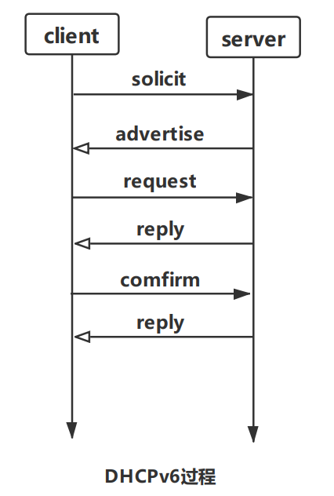

# IPv6基础: DHCPv6

## 1. 介绍
## 2. DHCPv6协议
### 1. DHCPv6使用两个多播地址:
address|作用域|作用|
|---|---|---|
|[FF02::1:2](#)|link-scope|客户端用于和同一链路下的中继代理(relay agent)或者服务器(server)进行通信, 所有servers和agents都是这个多播组的成员|
|[FF05::1:3](#)|site-scope|代理服务器用于和服务器servers进行通信|
### 2. UDP端口:
+ 服务端(server)或者中继代理(relay agent):*[547](#)*
+ 客户端(client): *[546](#)*
### 3. 消息类型
|type|消息名称|作用|
|---|---|---|
|1|[solicit](#)|client发送solicit消息来定位server|
|2|[advertise](#)|当server收到solicit消息时会发送advertise消息用于通告它是一个可用的DHCP服务器|
|3|[request](#)|client发送request消息向一个指定的server请求配置参数(包括:IP地址等等)|
|4|[confirm](#)|client广播confirm消息到所有servers确认地址是否可用或者有某个client正在使用|
|7|[reply](#)|server或者agent响应client的请求|
|...|...|...|
### 4. DHCPv6过程

