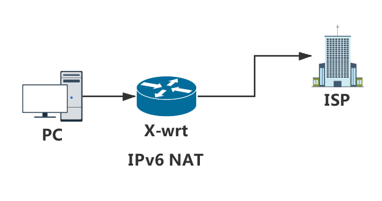
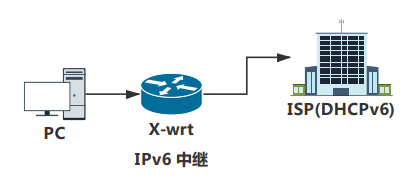
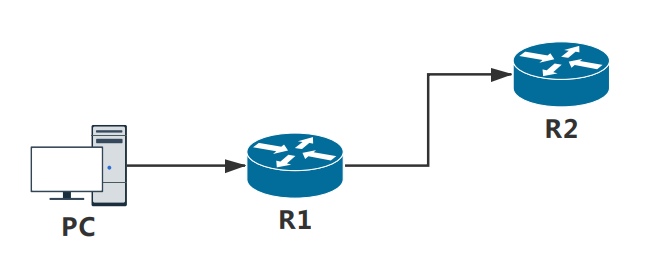

# X-wrt路由器下的客户端如何连接到Internet

## 1. 介绍
一台PC或者手机连接到X-wrt之后, 获取到IPv6地址之后访问Internet, 一般有几种方式实现, NAT, 中继(relay), 划分子网段. 

## 2. NAT方式
IPv6本身是不支持NAT, 但是可以通过ip6tables规则做数据转发.
### 2.1 网络拓扑


### 2.2 配置
+ dhcp
```
config dhcp 'lan'
    option interface 'lan'
    option dhcpv6 server
    option ra server
    option ra_default '1'
```
+ network
给lan接口配置一个ipv6地址:`2a02:768:7c00:14a:32b5:c2ff:feb9:c8f3/64`
```
config interface 'lan'
    option type 'bridge'
    option ifname 'eth0.1'
    option proto 'static'
    option ipaddr '192.168.15.1'
    option netmask '255.255.255.0'
    option ip6addr '2a02:768:7c00:14a:32b5:c2ff:feb9:c8f3/64'
```

### 2.3 规则
执行以下规则
```sh
$ ip6tables -t nat -A POSTROUTING -o eth0.2 -j MASQUERADE
$ ip6tables -A FORWARD -m conntrack --ctstate RELATED,ESTABLISHED -j ACCEPT
$ ip6tables -A FORWARD -i br-lan -j ACCEPT
```
### 2.4 结果
PC可以获取到lan口分配的IP, 然后访问外网的IPv6地址, 那么在ISP侧看到的PC的数据流的源地址是路由器的WAN口IP.

## 3 中继
不会影响IPv4地址获取
### 3.1 网络拓扑

### 3.2 配置
+ network
```
config interface 'lan'
	option type 'bridge'
	option ifname 'eth0.1'
	option proto 'static'
	option ipaddr '192.168.15.1'
	option netmask '255.255.255.0'
	option ip6assign '60'

config interface 'wan'
	option ifname 'eth0.2'
	option proto 'dhcp'
```
+ dhcp
```
config dhcp lan
    option dhcpv6 relay
    option ra relay
    option ndp relay

config dhcp wan
    option dhcpv6 relay
    option ra relay
    option ndp relay
    option master 1
```
### 3.4 结果
PC可以获取ISP分配的IPv6地址(如果ISP支持DHCPv6), 而且PC还是可以获取到X-wrt分配的IPv4地址
## 4 本地前缀代理
R2给R1分配了一个地址, R1给PC分配一个内网地址
### 4.1 网络拓扑


### 4.2 R2配置
+ dhcp
```
config dhcp 'lan'
    option interface 'lan'
    option start '100'
    option limit '150'
    option leasetime '12h'
    option dhcpv6 'server'
    option ra 'server'
    option ra_management '2'
    option ra_default '1'
```
+ network
```
config interface 'lan'
    option type 'bridge'
    option ifname 'eth0.1'
    option proto 'static'
    option ipaddr '192.168.16.1'
    option netmask '255.255.255.0'
    option ip6addr '2a02:9999:1234:14a:32b5:c2ff:feb9:c8f3/48'
    option ip6prefix '2a02:9999:1234::/48'
```
```
说明:
R2: 指定了lan接口IPv6地址之后, 需要ip6prefix指定这个接口允许的网段
```
### 4.3 R1配置
+ dhcp
```
config dhcp 'lan'
    option interface 'lan'
    option start '100'
    option limit '150'
    option leasetime '12h'
    option dhcpv6 server
    option ra server
    option ra_management 2
    option ra_default '1'

```
+ network
```
config interface 'lan'
    option type 'bridge'
    option ifname 'eth0.1'
    option proto 'static'
    option ipaddr '192.168.15.1'
    option netmask '255.255.255.0'
    option ip6assign '64'

config interface 'wan'
    option ifname 'eth0.2'
    option proto 'dhcp'

```
```
说明:
    R1的lan接口指定子网段前缀长度为64, 即把WAN的IPv6地址
```
