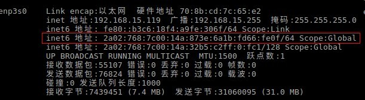

# X-wrt IPv6: dhcp简单配置(服务器模式)

## 1. 介绍
LAN接口配置dhcpv6的服务, 网关给局域网的主机分配IPv6地址

## 2. 步骤

### 2.1 newtork配置
```
$  vim  /etc/config/network
```
在[lan](#)的[interface](#)添加配置项

+ [ip6addr](#): 给接口配置一个ipv6地址:`2a02:768:7c00:14a:32b5:c2ff:feb9:c8f3/64`
```
config interface 'lan'
    option type 'bridge'
    option ifname 'eth0.1'
    option proto 'static'
    option ipaddr '192.168.15.1'
    option netmask '255.255.255.0'
    option ip6addr '2a02:768:7c00:14a:32b5:c2ff:feb9:c8f3/64'
```

### 2.2 dhcp配置
```
$ vim /etc/config/dhcp
```
+ 开启dhcpv6服务器: 
    `option dhcpv6 'server'`
    `option ra 'server'`
```
config dhcp 'lan'
        option interface 'lan'
        option start '100'
        option limit '150'
        option leasetime '12h'
        option dhcpv6 'server'
        option ra 'server'
        option ra_management '1'
        option ra_default '1'
```

### 2.3 重启网络, dhcp服务器
```
$ /etc/init.d/network  restart
$ /etc/init.d/dnsmasq  restart
```

## 2.4 客户端重新获取IP
+ 客户端可以看到接口获取到IPv6地址
```
$ ifconfig
```


+ ping网关的IPv6地址
```
$ ping6 2a02:768:7c00:14a:32b5:c2ff:feb9:c8f3 
```

