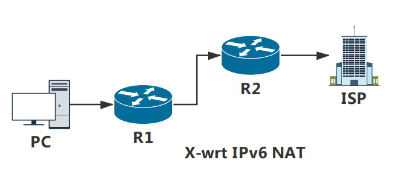

# X-wrt IPv6: NAT模式

## 1. 介绍
X-wrt可以通过中继的模式获取到原始的IPv6的IP

## 2. 网络拓扑


## 3. R1配置
### 3.1 配置
[参考 DHCP服务(服务器模式)](./01-ipv6-lan-dhcp-server-mod.md)

### 3.2 执行命令

```sh
$ ip6tables -t nat -A POSTROUTING -o eth0.2 -j MASQUERADE
$ ip6tables -A FORWARD -m conntrack --ctstate RELATED,ESTABLISHED -j ACCEPT
$ ip6tables -A FORWARD -i br-lan -j ACCEPT
```

## 4. R2配置
### 4.1 配置
[参考 DHCP服务(服务器模式)](./01-ipv6-lan-dhcp-server-mod.md)

## 5. 测试
ping [R2](#) LAN的IPv6地址

`ping6 2a02:9999:1234:14a:32b5:c2ff:feb9:c8f3`


