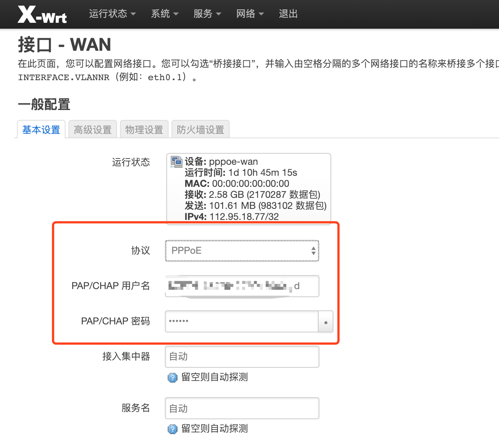
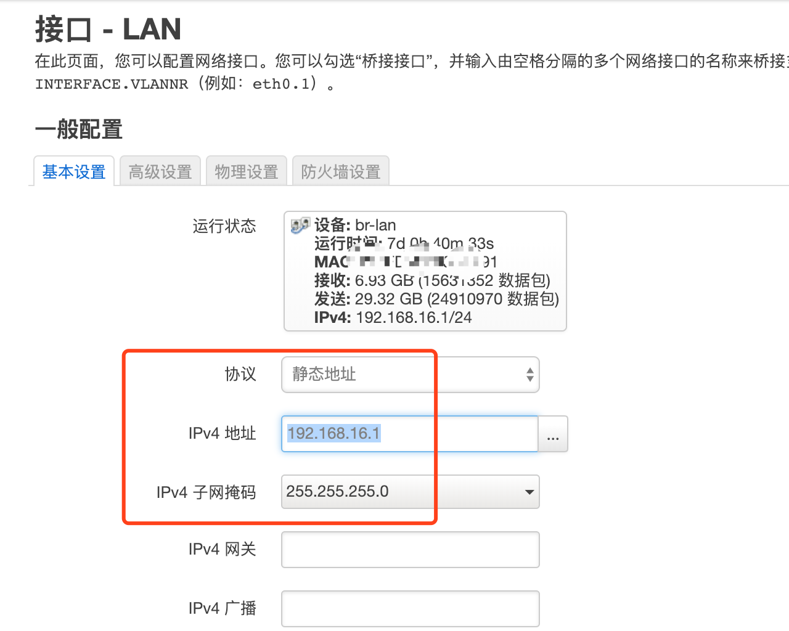
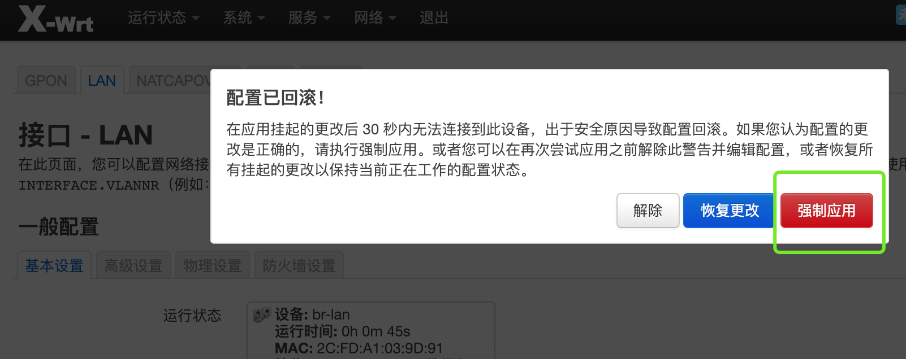
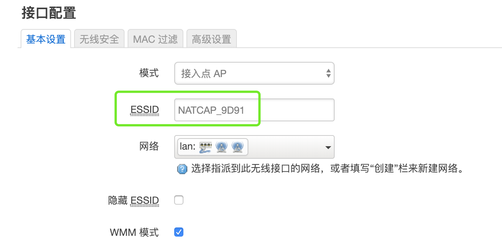
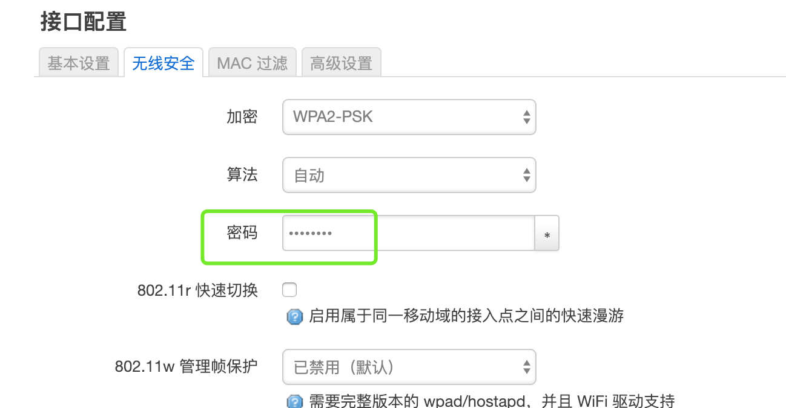

# 基本的网络配置教程
本教程在于指导那些对openwrt系统陌生的朋友快速上手，重点介绍上网设置，内网设置，无线配置等方面的功能的使用。

**注意：请使用谷歌浏览器，火狐浏览器，微软的浏览器，其他浏览器存在不可预知的问题。**

## 登录界面等
每个不同发布的固件管理界面登录地址可能都不一样，比如[@ptpt52](https://twitter.com/ptpt52)发布的[固件](https://downloads.x-wrt.com/rom/)默认管理地址是`http://192.168.15.1/`，登录账号和密码是`root/admin`，无线SSID名称是`X-WRT_XXXX`，默认的无线密码`88888888`。本教程以`ptpt52`发布的固件为例子做介绍。

## 上网设置
路由器刷机之后，大家可能会困惑的事情是如何联网。其实这很简单，一般是wan口用网线连接光猫或者连接上级路由器就可以了。

默认情况下，wan口是`DHCP客户端`的模式，也就是自动从上级获取IP地址。但是有些朋友的环境，需要路由器PPPoE拨号上网。如果需要拨号上网，就要修改一个wan口的配置填写好宽带账号和密码，才可以正常上网。

拨号上网：进入[网络 - 接口](#)页面，进入[wan](#)口[编辑](#)页面，选择协议`PPPoE`，填写`PAP/CHAP 用户名`和`PAP/CHAP 密码`，然后`保存应用`。

## 内网设置
这里说明的是内网`lan`口IP网段的修改，默认的网络是`192.168.15.0/24`，如果需要修改一个不同的网段，进入[网络 - 接口 - lan - 编辑](#)页面，修改需要的`IPv4 地址`和`IPv4 子网掩码`。

特别注意：这里`lan`的修改，IP发生变化，导致无法连接上管理界面，所以点[保存并应用](#)之后，界面会等待30秒，提示您是否要强制修改，点`强制应用`就可以了。然后电脑要重新连接网络，获取新的IP地址，访问新的管理地址。

## 无线配置
无线主要介绍SSID名称修改，无线密码修改，双频合一/分离介绍。

首先进入[接口 - 无线](#)页面，默认有两个无线（如果是单频只有一个），要逐个修改，点其中一个`编辑`进入编辑页面，在下方`接口配置 - 基本设置`标签下修改ESSID就是无线名字，在`无线安全`的标签下修改无线密码。请根据实际需要修改就行。

如果把两个无线（如果有）都修改成相同的SSID名称，相同的密码，就可以达到双频合一的效果，这也是推荐的方式，终端设备会自动在双频之间自动切换。如果需要也可以改成不同的SSID名称和密码。
