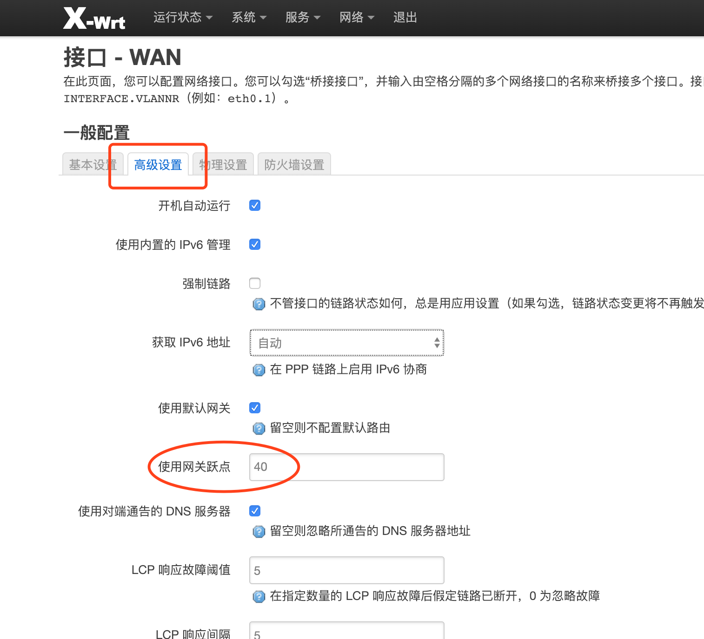
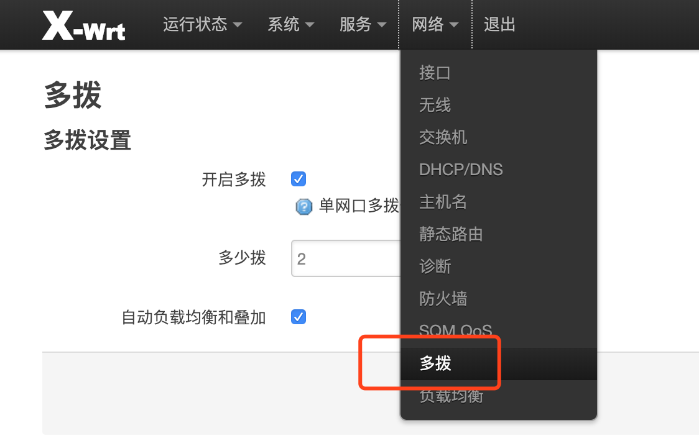

# 多拨和负载均衡配置教程

## 1. 介绍(单网口多拨)
很多⼈不知道怎么配置OpenWrt多拨，特写⼀个简易的教程，只要你的运营商⽀持多拨，照着这个教程做都可以多拨叠加⽹速。本教程适用于OpenWrt衍生版本[X-WRT的固件](https://downloads.x-wrt.com/rom/)。

**注意请使用谷歌浏览器，火狐浏览器，微软的浏览器，其他浏览器存在不可预知的问题。**

### 1.1 首先，正常设置好wan口拨号上网
在[网络-接口](#)页面，编辑[wan口-基本设置](#)，选择协议PPPoE，填写宽带账户密码:

修改[wan口-高级设置](#)，使用网关跃点 填写`40`，[防火墙设置](#) 选择wan

### 1.2 然后，开启多拨
进入[网络-多拨](#)页面，开启多拨，填写想要的多拨数，启用自动负载均衡和叠加:

开启多拨后，它会自动设置好负载均衡和叠加，对于高级用户，可以进入[网络-负载均衡](#)页面进行高级的调整，小白用户可以忽略。

**PS: 这里开启多拨，实际上用的网口就是1.1设置的wan口的接口**
